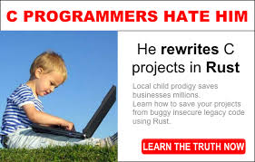
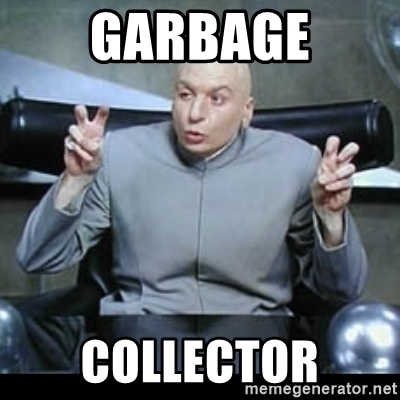
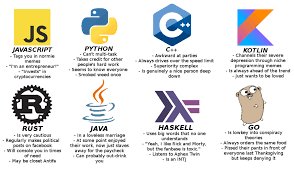
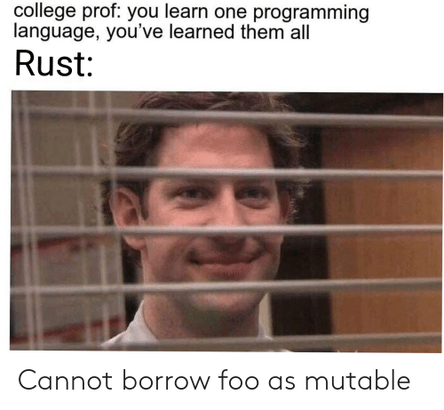
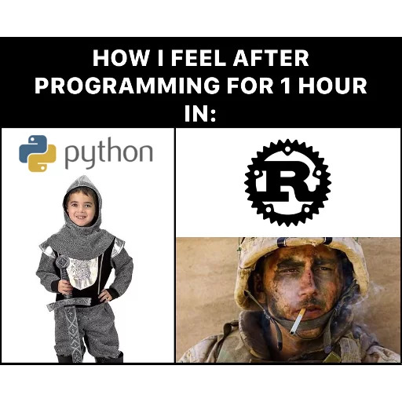
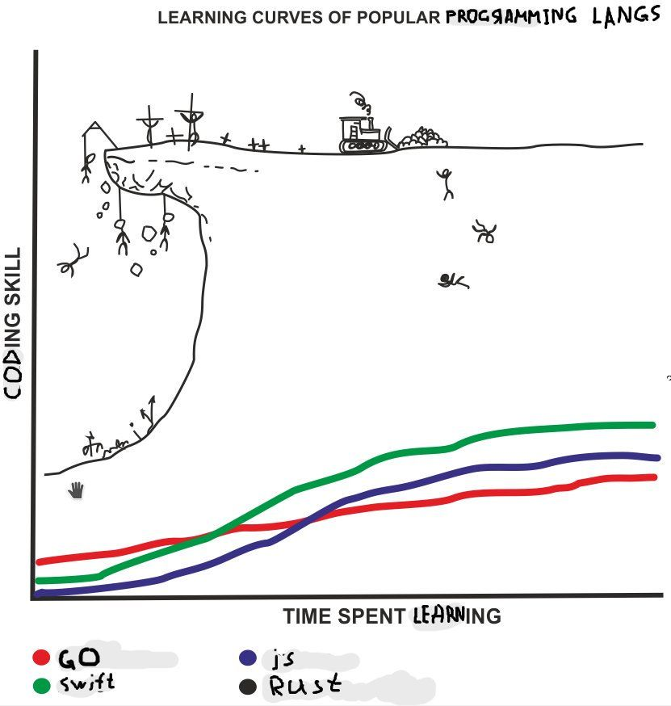

# Rust Lecture


### Summary ##

- [History](#history)

- [Rust Intro](#rust-intro)

- [Features](#features)

- [Popularity](#popularity)

- [Play](#play)

- [Conclusion](#conclusion)




#### History

C is the base

https://www.youtube.com/embed/Fm5Ust7vEhk


```C
#include <stdio.h>
int main() {
printf("Hello, World!");
return 0;
}
```

- What is memory management

C & C++ use manual memory management

```c++

// C++ Program to store GPA of n number of students and display it
// where n is the number of students entered by the user

#include <iostream>
using namespace std;

int main() {
    int num;
    cout << "Enter total number of students: ";
    cin >> num;
    float* ptr;

    // memory allocation of num number of floats
    ptr = new float[num];

    cout << "Enter grades of students." << endl;
    for (int i = 0; i < num; ++i) {
        cout << "Student" << i + 1 << ": ";
        cin >> *(ptr + i);
    }

    cout << "\nDisplaying GPA of students." << endl;
    for (int i = 0; i < num; ++i) {
        cout << "Student" << i + 1 << " :" << *(ptr + i) << endl;
    }

    // ptr memory is released
    delete[] ptr;

    return 0;
}


```
- What will happens if you forget to delete.

https://stackoverflow.com/questions/14987318/what-happens-if-i-dont-delete
  
- [Heap and Stack](https://stackoverflow.com/questions/24891/c-memory-management/24922)

- C++ came in the game : https://www.youtube.com/watch?v=JBjjnqG0BP8

C++ and [its challenges](https://www.toptal.com/c-plus-plus/top-10-common-c-plus-plus-developer-mistakes) 

- Then garbage collector language like Java, C#, python to name few of them



- What's a garbage collector?

- Garbage collector vs Manual allocation
  
- Found this https://github.com/plasma-umass/memory-landscape
  


- Golang came in the game 

Is the memory management challenge solved ? 

[Not really](https://www.abetterinternet.org/docs/memory-safety/)

[We can ask Microsoft](https://github.com/microsoft/MSRC-Security-Research/blob/master/presentations/2019_02_BlueHatIL/2019_01%20-%20BlueHatIL%20-%20Trends%2C%20challenge%2C%20and%20shifts%20in%20software%20vulnerability%20mitigation.pdf)

[Garbage collection in .Net](https://docs.microsoft.com/en-us/dotnet/standard/garbage-collection/fundamentals)

[jvm_exploit](https://www.sciencedirect.com/science/article/pii/S1742287617300269)

[Did Java solved it ?](https://stackoverflow.com/questions/218384/what-is-a-nullpointerexception-and-how-do-i-fix-it
)

[bug with GC in Chrome](https://securitylab.github.com/research/garbage-collection-uaf-chrome_gc/)


The garbage collector issues with a nice example : [discord](https://discord.com/blog/why-discord-is-switching-from-go-to-rust)

- Then a new challenger arrived, with releases in 2015, 2018 and 2021.




### Rust Intro

- 2006 personal project at Mozilla
  
- From OCaml to [LLVM](https://llvm.org/) based compiler written in Rust

- [Compile to Native Machine Code](https://stackoverflow.com/questions/43385142/how-is-rust-compiled-to-machine-code/43385776)

- Very first release in 2015  

- Used in the firefox web browser
  
- Its own [foundation](https://foundation.rust-lang.org/) in 2021 
  
- Most loved languages from 2016 from [stackoverflow survey](https://insights.stackoverflow.com/survey/2020#technology-most-loved-dreaded-and-wanted-languages-loved)

- Companies / products using [Rust in production](https://www.rust-lang.org/production/users)

Discord, Npm, Delivroo, 


### Features

#### Memory safe:

-> [Ownership](https://doc.rust-lang.org/nomicon/ownership.html) that allows you to: 

**a.** `Mutate` on object/variable so you can `write` with `mut` 


**b.** `Borrow` an object so you can `Read` some of its value to use later with`&`


**c.** `Own` an object in an scope that manages its memory automatically , just pass it as assignment et or function


**d.** Makes the compiler `checks` everything for you, it will be your best enemy first and then your best friend later :D


###### Examples


**a.** Mutability & Immutability

```rust

struct Company {
  pub name: String,
  /// In Billion
  pub value: u32,
}

fn main() {
  let mut facebook = Company {
    name: "FaceMash".to_string(),
    value: 0,
  };
  
  // <- if we do not use mut here, compiler will say NO
  facebook.name = "Facebook".to_string();
  facebook.value = 900;

  println!("{} new name is cool ", facebook.name);
}
```

**b.** Borrowing data to read it.

```rust


fn display_data(company: &Company) {
  println!("Name : {} ", company.name);
  println!("Market Cap : {} ", company.name);
  println!("Rating {}", rate_business(&company.value))
}

fn main() {
    // ---- Rest of the code
  // 2 - Reference with `&` to read data
  // <- if we do not use & here, compiler will say NO because function asks for it.
  display_data(&facebook);
}

```
**c.** Owning an object to move it ( to consume it ) to do stuff with it. 

```rust


fn rebuild_business(_: Company) -> Company {
  Company {
    name: "Facebook 2.0".to_string(),
    value: 850,
  }
}


fn main() {
  
  // ---- Rest of the code
  println!("{} is super old, we need rebranding ", facebook.name);


  facebook.name = "Meta".to_string();
  println!("{} is an awesome name", facebook.name);

  // <-- we move `facebook` inside the scope of the `rebuild_business` function so we cannot access it anymore .
  let mut new_facebook = rebuild_business(facebook);

  // println!("{} is still alive ?", facebook.name); <-- get moved error value
  display_data(&new_facebook);
  
}


```


**d.** Compiler check for everything for you

Little surprise with mutable references :D

```rust

fn update_name(company: &mut Company, new_name: &str) {
  company.name = new_name.to_string();
}


fn main (){

  // --- Rest of the code ---
  let update = &mut new_facebook; // Can only make a single mutable reference.

  // display_data(&new_facebook); Cannot read while writing :D
  // let update2 = &mut new_facebook;  throw error here because we can only have mutable reference at the same time.
  update.name = "Facebook 3.0".to_string();
  println!("{} is an awesome name.", new_facebook.name);

  let update2 = &mut new_facebook;
  update2.name = "Facebook 4.0".to_string();

  // <- Update name without taking ownership with function
  update_name(&mut new_facebook, "Facebook 3000");
  println!("{} is an awesome name.", new_facebook.name);
}

```

###### Resume

Pros :
- Rules to write and read are easy 
- No extra syntax for these rules ( like Malloc or delete)
- Everything is actually automated ( not need to delete object or do memory stuff on basic levels)
- The Compiler checks everything for you
- No need to think about technical detail so you can focus on business logic.

Cons : 
- Redefine the way you write code because you need to turn upside down your brain
- You will hate the compiler
- Get addicted to the safety


Is memory safety solved?

[There are bugs](https://github.com/Artisan-Lab/Rust-memory-safety-bugs)
You can do manual [memory management](https://stackoverflow.com/questions/48485454/rust-manual-memory-management) if you want in Unsafe mode




#### Traits
  
[Inheritance vs trait compositions](https://en.wikipedia.org/wiki/Composition_over_inheritance#)

**a.** Nice to have for objects that shared common behavior

**b.** Nice for libraries and use of Generics and have limitations

**c.** OP for having many types handled together

**d.** Can be understood as `interfaces` in some languages

###### Examples

Got the idea to simulate the weapons system from Skyrim and how damages are dealt based on the stuff

https://en.uesp.net/wiki/Skyrim:Block#Defensive_Blocking

###### 1 - How to define weapons and armor

###### 2 - How to define a character

###### 3 - How to define a *fight*


As you will see , I took some freedom from their documentation for the calculation.

NB :
- Mainly kept the rules for blocking for dual_wielding, two hands weapons, shield + single weapon and one single weapon only.

- Coding with the flow, no much thinking because I had tons of fun

###### 1 - Armor & Weapons

```rust

// Every "object ( weapons or armor is an item with a name )

pub trait Item {
  fn name(&self) -> &str;
  fn set_name(self, name: &str) -> Self
    where
            Self: Sized;
}

// We have some Armor
pub trait Armor: Item {
  fn set_armor_rating(self, armor_rating: ArmorRating) -> Self
    where
            Self: Sized;
  fn armor_rating(&self) -> &ArmorRating;
}

pub trait Weapon: Item {
  /// Describe how much damage a weapon can deal.
  /// More damage a weapon deals, better quality it is .
  fn damages(&self) -> &RawDamages;
  fn set_damages(self, amount: RawDamages) -> Self
    where
            Self: Sized;
  // Block attack and make calculation if possible
  fn can_block_if_possible(&self) -> Option<BlockedDamages> {
    match self.handheld_type() {
      HandheldType::SingleHand => Some(self.damages() * 0.4),
      HandheldType::TwoHands => Some(self.damages() * 0.7),
      // A bit dummy here because we have different implementation later.
      HandheldType::OnlyLeft => None,
    }
  }
  fn set_handheld_type(self, handheld: HandheldType) -> Self
    where
            Self: Sized;
  fn handheld_type(&self) -> &HandheldType;
}

// Can make alias type for better semantic.
pub type BlockedDamages = f32;
pub type RawDamages = f32;
pub type ArmorRating = f32;

```


-> Now we can make some struct that implement this trait.

Here is the shield which is a weapon, but it also has armor properties.

```rust

// ----- Rest of the Code

pub struct Shield {
    armor_rating: f32,
    name: String,
    hold: HandheldType,
    bash_damage: RawDamages,
    handheld: HandheldType,
}

impl Default for Shield {
    fn default() -> Self {
        Shield {
            armor_rating: 0.0,
            name: "".to_string(),
            hold: HandheldType::OnlyLeft,
            bash_damage: 0.0,
            handheld: HandheldType::OnlyLeft,
        }
    }
}

impl Armor for Shield {
    fn set_armor_rating(mut self, reduction: f32) -> Self {
        self.armor_rating = reduction;
        self
    }

    fn armor_rating(&self) -> &f32 {
        &self.armor_rating
    }
}

impl Item for Shield {
    fn name(&self) -> &str {
        &self.name
    }

    fn set_name(mut self, name: &str) -> Self {
        self.name = name.to_string();
        self
    }
}

impl Weapon for Shield {
    fn damages(&self) -> &RawDamages {
        &self.bash_damage
    }

    fn set_damages(mut self, amount: RawDamages) -> Self {
        self.bash_damage = amount;
        self
    }

    fn can_block_if_possible(&self) -> Option<BlockedDamages> {
        //We could have skills here to help us to calculate
        Some(self.armor_rating)
    }

    fn set_handheld_type(mut self, handheld: HandheldType) -> Self {
        self.handheld = handheld;
        self
    }

    fn handheld_type(&self) -> &HandheldType {
        &self.handheld
    }
}

// NB: I could have made multiple trait instead of enum as well.
#[derive(PartialEq)]
pub enum HandheldType {
  SingleHand,
  OnlyLeft,
  TwoHands,
}

impl Shield {
    pub fn new(name: &str, armor: f32, bash_damages: f32) -> Self {
        Self::default()
            .set_name(name)
            .set_armor_rating(armor)
            .set_handheld_type(HandheldType::OnlyLeft)
            .set_damages(bash_damages)
    }
}


```


Check the code for more examples.

Character definition and Stuff definition that qualifies the weapons + armor configuration.


###### 2 - Character
```rust

pub struct Character {
    name: String,
    health: f32,
    max_health: f32,
    stuff: Stuff,
}

/// Here we store any kind of weapons and armor.
/// Stuff contains specific pointers to dynamic object
/// The compiler will say No to this until you tell him that the object size is know at compile time in the trait definition.
/// That is why we have the word `Sized` for self in previous trait.
#[derive(Default)]
pub struct Stuff {
    armor: Option<Rc<dyn Armor>>,
    first_weapon: Option<Rc<dyn Weapon>>,
    second_weapon: Option<Rc<dyn Weapon>>,  // Rc is a specific reference pointer
}

impl Stuff {
  
// Many other methods  
/// Will panic if you have equipped a two hand weapon as a second Weapon.
///  
pub fn equip_weapon<W: 'static + Weapon>(mut self, weapon: W) -> Self {
  match weapon.handheld_type() {
    HandheldType::SingleHand => {
      if let Some(current_weapon) = self.first_weapon() {
        if current_weapon.handheld_type() == &HandheldType::SingleHand {
          self.second_weapon = Some(current_weapon.clone())
        }
      }
      self.set_first_weapon(weapon);
    }
    HandheldType::OnlyLeft => {
      if let Some(current_first_weapon) = self.first_weapon() {
        if current_first_weapon.handheld_type() == &HandheldType::TwoHands {
          self.unset_first_weapon();
        }
      }

      // See comment on how we could avoid this issue at compile time.
      // if First weapon is set or not, we do not care, left item always goes left.
      if let Some(current_second_weapon) = self.second_weapon() {
        if current_second_weapon.handheld_type() == &HandheldType::TwoHands {
          panic!("It seems you have a two hand weapon as second weapon");
        }
      }

      self.set_second_weapon(weapon)
    }
    HandheldType::TwoHands => {
      self.unset_second_weapon();
      self.set_first_weapon(weapon);
    }
  }
  self
}

}
//
```


###### 3 - Fight

```rust


pub struct Fight {
    winner_name: Option<String>,
    round: u16,
    opponents: (Character, Character),
}

#[allow(unused)]
impl Fight {
    pub fn winner_name(&self) -> &Option<String> {
        &self.winner_name
    }
    pub fn round(&self) -> u16 {
        self.round
    }
    pub fn opponents(&self) -> &(Character, Character) {
        &self.opponents
    }
    pub fn new(first_fighter: Character, second_fighter: Character) -> Self {
      Fight {
        winner_name: None,
        round: 0,
        opponents: (first_fighter, second_fighter),
      }
    }

    pub fn start(&mut self) {
        // My ugly code you can check
    }
}

```


Here is how the "game" looks like.

```rust

mod character;
mod dice;
mod fight;
mod item;
mod stuff;
use crate::character::Character;
use crate::fight::Fight;
use item::*;

fn main() {
  println!("Hello and Fight");

  // Lets put some armors.
  let iron_plate = BodyArmor::new("Iron Plate", 32.0);
  let steel_plate = BodyArmor::new("Steel Plate", 54.0);
  let daedric_armor = BodyArmor::new("Daedric Armor", 25.0);
  let daedric_armor_2 = BodyArmor::new("Daedric Armor 2", 25.0);

  // Lets put some shields
  let steel_shield = Shield::new("steal Shield", 55.0, 20.0);
  let iron_shield = Shield::new("Iron Shield", 25.0, 15.0);

  // Lets put some weapons.
  let iron_long_sword = RegularWeapon::new("Iron Long Sword", 35.0, HandheldType::SingleHand);
  let steel_battle_axe = RegularWeapon::new("Steel battle Axe", 65.0, HandheldType::TwoHands);
  let daedric_battle_axe = RegularWeapon::new("Daedric battle Axe", 85.0, HandheldType::TwoHands);

  let grand_ma_skyrim = Character::new("Skyrim Grandma", 300.00)
          .grab_weapon(steel_battle_axe)
          .grab_armor(daedric_armor);

  let white_run_guard = Character::new("Olaf the dummy guard", 300.00)
          .grab_weapon(steel_shield) // <- we can do it because of generic + trait objects for weapon
          .grab_weapon(iron_long_sword)
          .grab_armor(daedric_armor_2);

  Fight::new(white_run_guard, grand_ma_skyrim).start();
}


```


###### Resume

Pros: 
- We can make many object with different types and handle them as long as they have the behavior we need.
- Can make default behavior
- Flexible and we can store object without specific type as long as their size is safe = we know their size at compile time
- Everything is always checked by our lovely compiler
- Can back up stuff with unit-test

Cons:
- Require some training to understand Generics and trait object 
- Need to use specific new pointer like Rc/Arc for advanced stuff
- The compiler will be painful with you


#### Conditional compilation

Well, you can decide what to compile or not :D


##### Example


- Running tests

```rust

#[cfg(test)]
mod test {
    
    // --- unit test 
}


```

`cargo test`

The command will compile unit test and run them.


- Having specific features

```toml
[features]
song=[]
```

Now in your code

```rust
#[cfg(feature = "song")]
fn add_song() {
    println!("Here is the song of the Dovakin")
}
```


We add the function in main as well :D

```rust
fn main() {
    // ------ Rest of the code
    #[cfg(feature = "song")]
        add_song();
}
```


How to run :


`cargo run --features song`

###### Resume

Pros:
- You decide what you want to compile
- Super useful to reduce the size of your package and use only what you need

Cons:
- Use strings, so little helping from the IDE ( just a bit still :D)

Good example to use for this is [web_sys](https://docs.rs/web-sys/0.3.56/web_sys/) library as bridge between Rust and the Web




#### Multithreading


[Multiple concurrency models](https://rust-lang.github.io/async-book/01_getting_started/02_why_async.html)


##### Example

Let's make 2 fights simultaneously and take the winner for the last one.


```rust

    // ----- Rest of the Code

    let (tx_1, rx_1) = mpsc::channel();
    // This is OS native Thread
    let _ = thread::spawn(move || {
        let winner = Fight::new(white_run_guard, grand_ma_skyrim).resolve();
        tx_1.send(winner)
            .expect("Should have passed the resolved winner");
    });

    let (tx_2, rx_2) = mpsc::channel();

    // This is OS native Thread
    let _ = thread::spawn(move || {
        let winner = Fight::new(lydia, dovakin).resolve();
        tx_2.send(winner)
            .expect("Should have passed the resolved winner");
    });

    let second_fight_winner = rx_2.recv().expect("Should have receive the winner");
    let first_fight_winner = rx_1.recv().expect("Should have receive the winner");

    let final_winner = Fight::new(first_fight_winner, second_fight_winner).resolve();

    println!("The best fighter is : {}", final_winner.name());

```


Works like a charm. 
Of Course if my business logic sucks, then it won't work as expected, but that is not the compiler responsibility.
But unit-test are there for it :D

###### Resume

Pros:
- Took me 5 minutes to make it work
- No runtime wrong, if you do something wrong, the compiler will tell you :D
- You can make t

Cons:
- The compiler complained about the Type for Stuff because I needed to add trait bounds to ensure the code was safe ( but the compiler told me again soo :D)
- Need to think the specific pointer you use such as Rc vs Arc ( but again the compiler helps with that )


### Popularity


 [Discord switching from go to RUst](https://discord.com/blog/why-discord-is-switching-from-go-to-rust)

Why Linux, Android and Windows are switching to Rust now.

[Google starts using it for Android](https://arstechnica.com/gadgets/2021/04/google-is-now-writing-low-level-android-code-in-rust/)

[Aws](https://aws.amazon.com/blogs/opensource/how-our-aws-rust-team-will-contribute-to-rusts-future-successes/)

[Microsoft and Rust](https://www.zdnet.com/article/programming-languages-rust-for-windows-just-got-another-update/)

[Linux & Rust](https://www.zdnet.com/article/rust-takes-a-major-step-forward-as-linuxs-second-official-language/)

[Rust used for web](https://github.com/MoonZoon/MoonZoon)

[Rust game engine](https://bevyengine.org/)

OMG performances

[Simple Benchmark](https://medium.com/@dexterdarwich/comparison-between-java-go-and-rust-fdb21bd5fb7c)

[More Complex Benchmark](https://medium.com/star-gazers/benchmarking-low-level-i-o-c-c-rust-golang-java-python-9a0d505f85f7)


### Play 

https://github.com/danistefanovic/build-your-own-x

### Conclusion

- Can be used everywhere

- Great Performance

- Your code is bug free easy

- Concurrency is easy

- Super community

- Made to change the world


[Rust Discord](https://discord.gg/HGqdyVma)

[Ringrev Discord](https://discord.gg/xNQ9earE)





